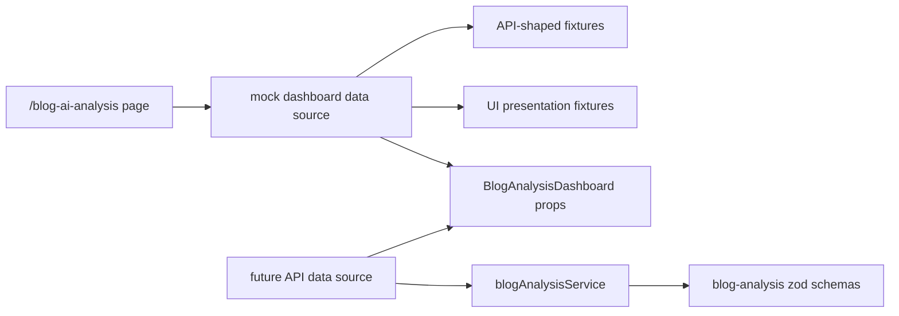

# Blog Analysis API And Mock Update Design

## Goal

Update the blog analysis domain types and mock data to match the new backend API reference while keeping the current page usable before the backend is ready.

## Scope

- Update only the blog analysis domain API contracts and page data boundary.
- Do not change the shared Axios interceptor or unwrap the global `ApiResponse` wrapper in this task.
- Keep `/blog-ai-analysis` backed by mock data for now.
- Shape mocks so the API-backed data source can replace them with minimal page changes later.

## API Contract Changes

The API reference shows all successful responses as `{ success, data, responseTime }`, but this task will keep service schemas focused on the `data` payload because the shared HTTP layer is unchanged.

Blog analysis payload schemas should match these endpoint payloads:

- `POST /blog/analyze`
  - request: `blogId`, `documentId`
  - response data: `documentId`, `status`, `message`, `aiCreditRemaining`
- `GET /blog/analysis/{documentId}`
  - response data: `documentId`, `status`, `analysis`, `analyzedAt`
  - `analysis`: `summary`, `keyTopics`, `tone`, `targetAudience`, `suggestions`
- `GET /blog/analysis/history`
  - response data: `content`, `totalElements`, `visibleCount`
  - item: `id`, `channelUrl`, `analyzedAt`, `isLocked`
- `GET /blog/analysis/{analysisId}/recommendations`
  - response data: `analysisId`, `campaigns`
  - item: `id`, `title`, `fitnessScore`, `selectionScore`, `reasonType`, `reasonMessage`
  - `reasonType` includes `CATEGORY_MATCH`
- `GET /blog/analysis/{analysisId}/bloggers`
  - response data: `category`, `bloggers`
  - item: `nickname`, `overallScore`, `profileUrl`
- `POST /blog/chat`
  - request and response stay aligned with the reference.
- `DELETE /blog/chat/{sessionId}`
  - service returns `null` payload.

## Mock Strategy

Current UI sections need data that the API reference does not provide yet, including chart metrics, category fit rows, insight cards, campaign card fields, and richer blogger card fields. These fields should not be forced into API response schemas.

Instead:

- Keep API payload fixtures typed by the API schemas.
- Add page-specific presentation mock data for fields that only the current screen needs.
- Build a small page data source function that returns the complete dashboard props.
- Later, an API-backed data source can call `blogAnalysisService` and combine the response with either real backend fields or UI fallback data.

## Data Flow

`/blog-ai-analysis/page.tsx` should load dashboard data from a blog analysis page data source. For now that data source returns mocks. The `BlogAnalysisDashboard` component should stay mostly presentational.

## Testing

- Add schema tests for the new API reference payload examples before changing production schemas.
- Update existing Playwright expectations only when display copy or mock names change.
- Run `yarn type-check` and `yarn lint`.

## Commit Plan

- Commit 1: design spec.
- Commit 2: failing tests for updated blog analysis schemas.
- Commit 3: schema and service updates.
- Commit 4: mock data/data-source/UI adapter updates.
- Commit 5: verification or test expectation updates if needed.
